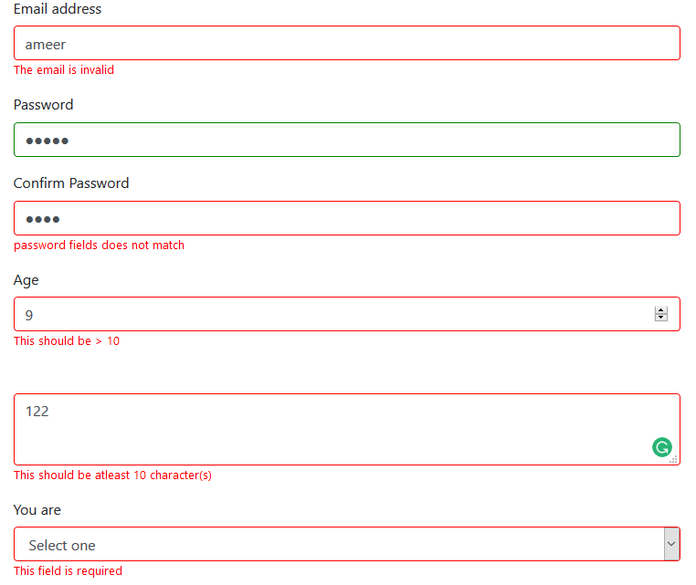

# jQuery Simple Validator :white_check_mark:

Love HTML5 validation :heart: and tired of validating forms with JavaScript :hankey: then this is for you :beers:



## How it works ?

1. It picks up all the HTML5 validations in a form and makes them JavaScript driven for you
2. Whenever a field is invalid it adds the class **error** to the field
3. Whenever a field is valid it adds the class **no-error** to the field
4. It adds a error message below the input field if it's invalid

## Why should you use this ?

### Super light weight :balloon:

| Libraries               | Size   |
| ----------------------- | ------ |
| jquery-validator        | ~ 75kb |
| jquery-simple-validator | ~ 5kb  |

### No need to write any f\*\*\*\*\*\* JavaScript :hammer: to get started!

The Main goal of **jQuery simple validator** is to keep it simple with just **HTML5 validations** thus
you absolutely need no **JavaScript** to be written to start validating your forms

## Getting Started

1. Add jQuery and jQuery Simple Validator to your site

```html
<script src="jquery-3.3.1.min.js"></script>
<script src="jquery-simple-validator.min.js"></script>
```

2. Add little styling to make things preety

```css
input:not([type="file"]).error,
textarea.error,
select.error {
  border: 1px solid red !important;
}

input:not([type="file"]).no-error,
textarea.no-error,
select.no-error {
  border: 1px solid green !important;
}

div.error-field {
  color: red;
  font-size: small;
}
```

3. Add validate=true attribute to the forms you want to validate

```html
<form validate=true>
  ...
</form>
```

Voila! now all your HTML5 validations will have a new look like a charm!

## Supported Validations

### Required

Add the HTML5 attribute required to mandatory fields

```html
<input type="text" name="username" required>
<input type="password" name="password" required>
<select required>
  ...
</select>
<input type="file" name="propic" required>
<textarea required></textarea>
```

### Email

For the email type input fields email validations will be applied

```html
<input type="email">
```

### Min Length and Max Length

Add the HTML5 attribute minlength, maxlength to specify the allowed minimum and maximum number of characters

```html
<textarea minlength="10" maxlength="40"></textarea>
```

### URL

For the URL type input fields url validations will be applied

```html
<input type="url">
```

### Number

For the number type input fields the value will be validated to be a number

```html
<input type="number" name="age "min="10" max="100">
```

* **min**: Minimum allowed number
* **max**: Maximum allowed number

### Mobile

For the mobile type input fields 10 digit mobile number validations will be applied

```html
<input type="mobile">
```

### Pattern

If HTML5 attribute pattern is present in the input field it's value will be validated against it

```html
<input name="country_code" pattern="^[A-Za-z]{3}$">
```

### Match

Two input fields can be cross validated to have same value, for instance password and confirm password field

```html
<input type="password" id="passwordInput">
<input type="password" data-match="password" data-match-field="#passwordInput">
```

* **data-match**: The word to be used in error message
* **data-match-field**: The other field whoes value is to be compared with this input field

### File Types

The file input field can be validated to have only specific file types

```html
<input type="file" data-file-types="image/jpeg,image/png">
```

* **data-file-types**: Specifies the list of allowed mime types seperated by comma

### File Sizes

The file input field can be validated to have a minimum and a maximum file size if needed

```html
<input type="file" data-file-min-size="50kb" data-file-max-size="5mb">
```

* **data-file-min-size**: Specifies the allowed minimum size of file in kb, mb or gb
* **data-file-max-size**: Specifies the allowed maximum size of file in kb, mb or gb

## Custom error messages

You can add the attribute **data-error** to any input fields to customize the error message

## Roadmap

* [x] Create a basic validator targeting HTML5 validators
* [ ] Allow custom messages for specific validations
* [ ] Create async validator
* [ ] Create custom validator functions
* [ ] Add test suites

## License

MIT © [Ameer Jhan](mailto:ameerjhanprof@gmail.com)
